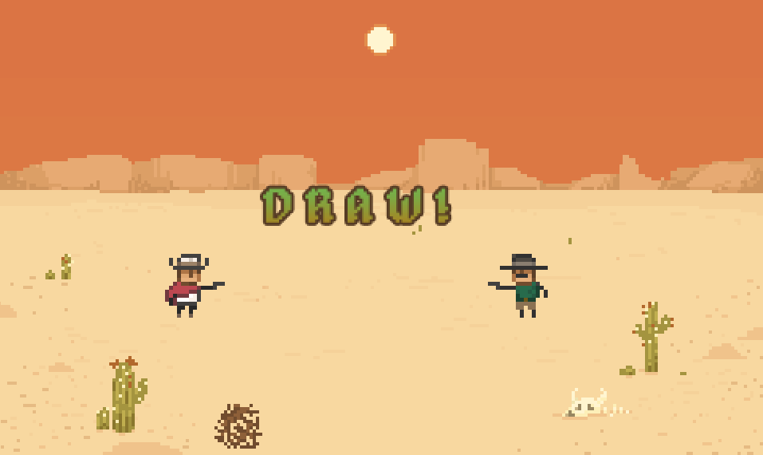

# Draw!

## How to Play:

It's a standoff! Press Space when it's time to draw, but not before!

The game was compiled for web using [WASM](https://webassembly.org/) and can be played here:

https://draw.rudyfaile.com/

## MacOS:

1. `./run` cleans, builds, and runs if build successful
2. `./run clean` cleans (good for removing prior to git commits
3. `./run prod` makes a draw_game.app macOS app

## Windows:

(Everything runs through run.bat)

`run.bat` does everything with options:
1. `run` builds and runs
2. `run build` only builds
3. `run clean` cleans files
4. `run debug` compiles with TCC for debugging 

(4coder bindings to run.bat)

1. F1 Clean
2. F2 Build
3. F3 Run
4. F4 Debug

## Linux:

1. `cd /compile/linux/`
2. `cmake .`
3. `make`

---

Old Windows info (MSVC)

1. `run build` calls build.bat with -dv by default (debug build, verbose). See build.bat for more options
2. `run run` calls `builds-debug\windows-msvc\draw_game.exe` by default
3. `run debug` initializes vcvars all then runs the executable with `devenv`
4. `run clean` destroys the `builds`, `builds-debug`, and `temp` directories 

---

Programmed in C using raylib. Check out raylib [here](https://github.com/raysan5/raylib/). 

---
MIT License

Copyright (c) 2020 Rfaile313

Permission is hereby granted, free of charge, to any person obtaining a copy
of this software and associated documentation files (the "Software"), to deal
in the Software without restriction, including without limitation the rights
to use, copy, modify, merge, publish, distribute, sublicense, and/or sell
copies of the Software, and to permit persons to whom the Software is
furnished to do so, subject to the following conditions:

The above copyright notice and this permission notice shall be included in all
copies or substantial portions of the Software.

THE SOFTWARE IS PROVIDED "AS IS", WITHOUT WARRANTY OF ANY KIND, EXPRESS OR
IMPLIED, INCLUDING BUT NOT LIMITED TO THE WARRANTIES OF MERCHANTABILITY,
FITNESS FOR A PARTICULAR PURPOSE AND NONINFRINGEMENT. IN NO EVENT SHALL THE
AUTHORS OR COPYRIGHT HOLDERS BE LIABLE FOR ANY CLAIM, DAMAGES OR OTHER
LIABILITY, WHETHER IN AN ACTION OF CONTRACT, TORT OR OTHERWISE, ARISING FROM,
OUT OF OR IN CONNECTION WITH THE SOFTWARE OR THE USE OR OTHER DEALINGS IN THE
SOFTWARE.
